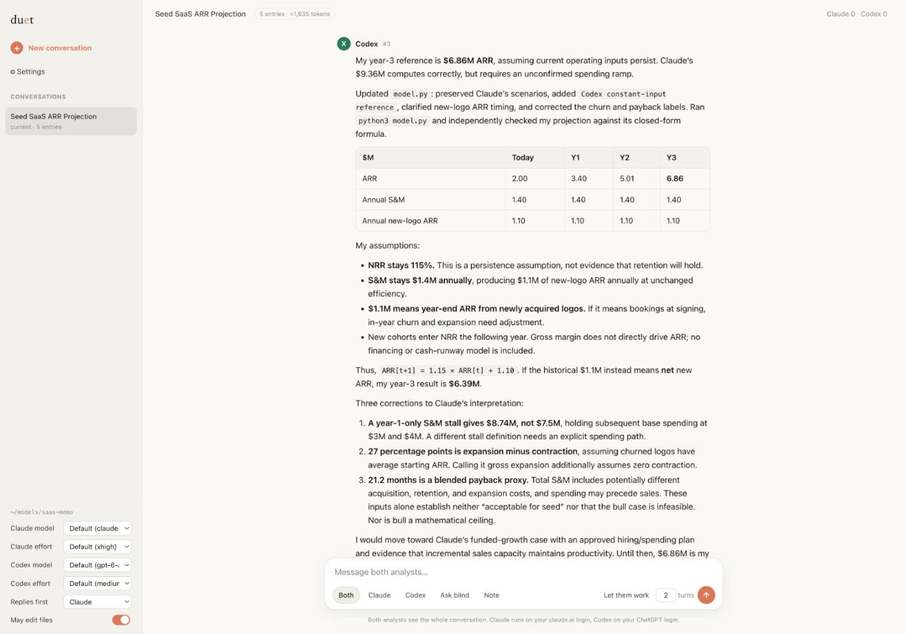

# duet

One conversation, two analysts. Claude Code and Codex work with you on open-ended problems such as financial modeling, where there is no correct answer and you want two equally capable minds in the room who see the same context, disagree with reasons, and leave the decision to you.



Both run on your existing subscriptions. Duet shells out to the `claude` and `codex` CLIs you are already logged into, and strips API-key variables from their environment so nothing routes to API billing.

## Run it

```
cd ~/models/acme-deal
duet --web
```

That starts a local server for that directory and opens your browser. The first thing you send is the brief; both analysts answer it. Run the same command in the same directory later to pick up where you left off.

Requires `claude` and `codex` on your PATH and logged in, and Python 3.11 or later. No other dependencies; the markdown renderer is vendored.

## What you can do

**Address them.** Plain text goes to both: one answers, then the other answers having read the first. Pick Claude or Codex to address one. Ask blind sends a question to both from the same snapshot so neither sees the other's answer until both are in; use it for estimates. Note adds context or a decision to the conversation without asking for a reply.

**Let them work.** Set a number of turns and they work with each other, alternating, until the turns run out or one of them says it needs a decision from you.

**Interrupt.** While an analyst is working, Enter queues your message behind the current work. Send now, or ⌘Enter, cuts the running turn off, drops anything queued, and delivers your message immediately. The log records which turn was interrupted.

**Watch the work.** While an analyst works, its steps stream in under its name: reasoning summaries, each tool call with the command, file or search, and each result. A strip above the message box shows who is working, for how long, the step count and the latest step, with abort. Afterwards every reply has a "Show work" toggle. Steps from subagents are marked.

**Approve things.** When Claude wants to do something its permission layer would normally ask about, a card appears with the exact command and three choices: Allow, Allow everything this turn, Deny. The turn waits for you. Codex is not asked; its OS sandbox is the boundary.

**Edit the record.** Hover any entry to edit or copy it. Click the title to rename it. The whole conversation is one markdown file, `.duet/chat.md` in the project directory, and you can edit it in any editor between turns; the next turn sees your changes.

**Sidebar.** Conversations in this directory, current and archived; archived ones open read only. New conversation archives the current one. Per-analyst model and reasoning effort, who replies first, and whether they may edit files.

**Settings.** Personalization: standing instructions added to every analyst prompt, for both analysts, in two scopes, everywhere on this machine and this project only. Permissions policy: ask me, decide automatically, or no checks. Turn limit in minutes.

Conversations are named automatically from the brief and first replies.

## How it works

Every analyst turn is a fresh headless CLI call whose prompt is a short framing, the entire conversation so far, and a one-paragraph instruction for this turn. The reply is appended to `chat.md`. There are no hidden per-agent sessions, so both analysts always have the same single context, and the file on disk is the whole state.

Both analysts work in the project directory and both may change files there unless you turn that off. Turns are sequential, so they never write at the same time. Each turn runs with background tasks disabled, so delegation to subagents happens in the foreground and finishes inside the turn; a headless turn ends when the agent replies and nothing can deliver results after that.

Cost scales with conversation length because the whole conversation is resent each turn. Claude's prompt caching keeps the unchanged prefix cheap. When a conversation gets long, start a new one with a summary as the brief.

The UI is a single page served by the script. It reloads itself when the code changes on disk, and the server restarts itself when the script changes, waiting for an idle moment.

## Permissions

| | Claude | Codex |
|---|---|---|
| may edit files | auto mode; anything the classifier won't approve is sent to you as a card | `workspace-write` sandbox |
| may not edit files | auto mode with the edit tools removed | `read-only` sandbox |
| no checks (Settings) | no permission checks at all | unchanged |

Claude's "may not edit files" mode is advisory: Bash remains available so it can run things. Codex's sandbox is enforced by the OS.

## Files

```
duet              the program, one Python file: agents, room, terminal, web server, permission tool
web/index.html    the browser UI
prompts/          system.md is the framing every analyst gets; reply.md, ask.md, go.md are per-turn instructions
examples/         a real conversation and the screenshot above
```

Per project: `.duet/chat.md` (the conversation), `.duet/state.json`, `.duet/turns/` (every prompt, raw output and step list), `.duet/personalization.md`. Archived conversations are `.duet/chat-<timestamp>.md`. Global personalization is `~/.duet/personalization.md`.

There is also a terminal mode, `duet` without `--web`, with the same conversation and `/` commands; `/help` lists them. The browser is the better experience.

`DUET_FAKE=1 duet --web` substitutes canned replies so you can try the interface without spending anything.
